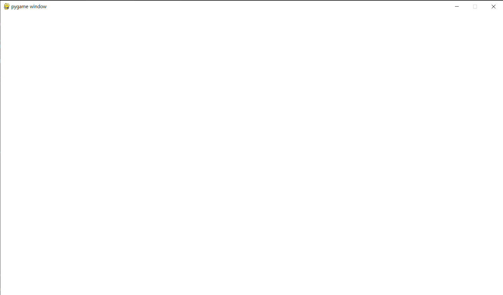

# **기본 틀 만들기**

> ※ 파이썬이 설치되어 있어야 합니다! ※

---

## 기본 코드

Pygame에서는 게임 창을 띄우고, 닫기 이벤트를 처리하는 기본 구조를 만들어야 합니다.  
아래 코드를 입력해보세요.  

<pre><code>import pygame

pygame.init()
WIDTH, HEIGHT = 1280, 720
screen = pygame.display.set_mode((WIDTH, HEIGHT))
clock = pygame.time.Clock()

running = True
while running:
    for event in pygame.event.get():
        if event.type == pygame.QUIT:
            running = False

    screen.fill((255, 255, 255)) # 흰색 배경
    pygame.display.update()
    clock.tick(60)

pygame.quit()</code></pre>

---

## 코드 설명

| 코드 | 설명 |
|------|------|
| <code>pygame.init()</code> | pygame 라이브러리를 초기화합니다. |
| <code>screen = pygame.display.set_mode((WIDTH, HEIGHT))</code> | 게임 창의 크기를 설정합니다. |
| <code>while running:</code> | 게임 루프를 시작합니다. |
| <code>for event in pygame.event.get():</code> | 발생한 이벤트(입력, 종료 등)를 감지합니다. |
| <code>screen.fill((255, 255, 255))</code> | 화면을 흰색으로 채웁니다. |
| <code>pygame.display.update()</code> | 변경된 내용을 화면에 반영합니다. |
| <code>clock.tick(60)</code> | 초당 60프레임으로 속도를 제한합니다. |

코드에 대한 더 자세한 설명은 [여기](../참고/기본_틀_상세_설명.md)를 누르세요.

---

## 실행 결과

> 프로그램을 실행하면 **1280×720 크기의 흰색 창**이 열리고, 창을 닫으면 정상적으로 종료됩니다.  

