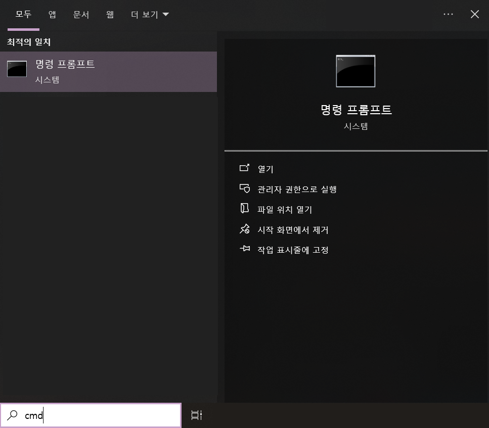
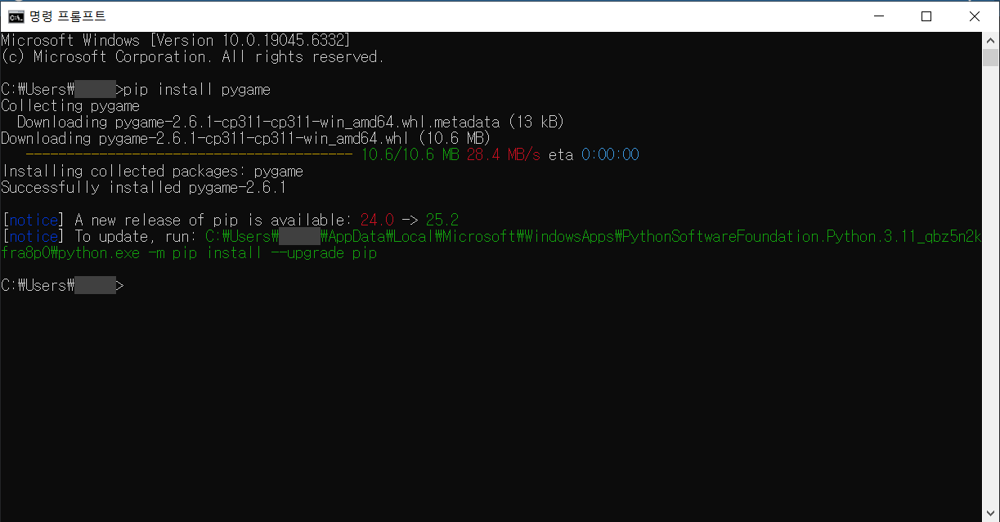

# **pygame 라이브러리 설치하기**

> <span class="caution">※ 파이썬이 설치되어 있어야 합니다! ※</span>

---

## <span class="title">pygame 라이브러리란?</span>

**pygame**은 파이썬으로 게임을 만들 때 사용하는 대표적인 라이브러리입니다.  
프로그램창 만들기, 도형 그리기, 키보드/마우스 입력 등 게임 개발에 필요한 기능을 제공합니다.  

---

## <span class="title">설치 방법</span>

1. **명령 프롬프트(cmd)** 창을 엽니다.  
    윈도우 검색창에 `cmd`를 입력 후 Enter 키를 누르세요.  
    

2. cmd에 아래 명령어를 입력하고 Enter 키를 누릅니다.  
    <pre>```
    pip install pygame
    ```</pre>
    

3. 설치가 완료되면 다음 명령어로 확인합니다.  
    <pre>```
    python -m pygame.examples.aliens
    ```</pre>

✅ 예제 게임이 실행되면 설치 성공!

---

## <span class="title">자주 발생하는 문제</span>

* `'pip'은(는) 내부 또는 외부 명령, 실행할 수 있는 프로그램이 아닙니다.`
  → 파이썬이 PATH에 등록되어 있지 않은 경우입니다.  
  **파이썬 설치 시 “Add Python to PATH” 옵션을 반드시 체크하세요.**

* `Permission denied` 또는 `Access denied`
  → 관리자 권한으로 cmd를 실행하세요.  
  (검색창 → cmd → 우클릭 → 관리자 권한으로 실행)

---

### 📎 참고 링크

* [Python 공식 다운로드 페이지](https://www.python.org/downloads/)
* [pygame 공식 문서](https://www.pygame.org/wiki/GettingStarted)

---

> <span class="caution">💡 Tip: 여러 라이브러리를 설치할 때는 `requirements.txt` 파일을 만들어 한 번에 설치할 수도 있습니다!</span>
